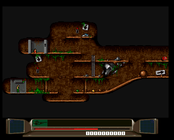
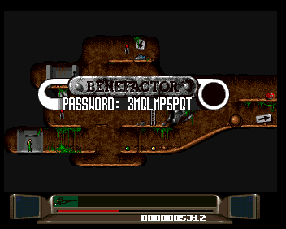

# Benefactor (Amiga 1994) — Native PC Port

A work-in-progress native PC port of the Amiga game *Benefactor* (1994, Psygnosis / Digital Illusions), driven by a hand-written C engine plus a recompiler that translates the original M68K binary subsystem-by-subsystem.

<p align="center">
  
  
  
</p>

The repository does **not** include the original game disks, the Kickstart ROM, or the WHDLoad install file — they're copyrighted. You must supply your own copies.

## Required files (you provide)

Hashes are SHA-256.

### To play the game (standalone PC port)

Drop the three disk images at the repo root:

```
Disk.1                                            25416a6e390cbe94e4b2375c9513a2adf3411072fc5b6069ea34a0f3ff697916  (1003520 bytes)
Disk.2                                            f3649c8db4adfce3c7da5e21cb018be098404771eceeec44741c2528e9071b73  (1003520 bytes)
Disk.3                                            8dd262d02174a6706d5214b25f7bd9fc4bffe94761e16c209b880bc1dd8e7a42  (1003520 bytes)
```

### To run the PC↔PUAE comparison harness (development only)

The harness boots PUAE as a reference, so it also needs the Kickstart ROM, its decryption key, and the WHDLoad install file in a `harness/` directory:

```
harness/Benefactor.slave                          7ee0edba0e0f3eb8da38fb3aaccead4324e7aa12a6d99ad81a9c15ecf33d4670  (1084 bytes)
harness/kick40068.A1200                           6d43840d4099a74170ea0f0425b6257c3891ebcaa39c4d1840075a9ab22b5707  (524288 bytes)
harness/rom.key                                   9e0677ae0979a5d9dc4d03ccc063b58bc36561dca98a3ef81df1c1c7f398a98e  (1544 bytes)
```

Verify any of them with `sha256sum -c` against the lines above.

## Build

```bash
git submodule update --init --recursive
cmake -S . -B build
cmake --build build -j"$(nproc)"
```

## Run

The standalone PC port (native game loop, single SDL window):

```bash
./run_pc_game.sh
```

Side-by-side comparison vs PUAE (used for verifying behavior):

```bash
./run_harness_interactive.sh
```

### Keyboard

| Key | Action |
|-----|--------|
| Arrows | Move |
| Z / Ctrl / Space / Return | Fire / Action |
| TAB | Cycle real-time speed (1× / 2× / 4×) |
| L | Debug: trigger LEVEL COMPLETE (the win banner) |
| O | Debug: trigger GAME OVER |
| F11 | Toggle fullscreen |
| Esc | Quit |

## Layout

| Path | Role |
|------|------|
| `src/pc.c` | Native game loop |
| `src/recomp/` | Recompiler runtime (hw / blitter / copper / native renderer) |
| `src/pc_overrides_*.c` | Hand-written C replacements for recompiled M68K functions |
| `src/generated/` | Recompiler output (M68K → C) |
| `tools/recomp/` | Python recompiler (regenerates `generated/`) |
| `vendor/libretro-uae/` | PUAE reference, used by the comparison harness |

See `CLAUDE.md` and `AGENTS.md` for the development workflow.
