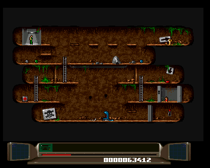

# Benefactor (Amiga 1994) — Native PC Port

A work-in-progress native PC port of the Amiga game *Benefactor* (1994, Psygnosis / Digital Illusions), driven by a hand-written C engine plus a recompiler that translates the original M68K binary subsystem-by-subsystem.

<p align="center">
  
  
  
  
</p>

The repository does **not** include the original game disks, the Kickstart ROM, or the WHDLoad install file — they're copyrighted. You must supply your own copies.

## Required files (you provide)

Hashes are SHA-256.

### To play the game (standalone PC port)

Drop the three disk images at the repo root:

```
Disk.1                                            25416a6e390cbe94e4b2375c9513a2adf3411072fc5b6069ea34a0f3ff697916  (1003520 bytes)
Disk.2                                            f3649c8db4adfce3c7da5e21cb018be098404771eceeec44741c2528e9071b73  (1003520 bytes)
Disk.3                                            8dd262d02174a6706d5214b25f7bd9fc4bffe94761e16c209b880bc1dd8e7a42  (1003520 bytes)
```

### To run the PC↔PUAE comparison harness (development only)

The harness boots PUAE as a reference, so it also needs the Kickstart 3.1 A1200 ROM and the WHDLoad install file in a `harness/` directory:

```
harness/Benefactor.slave                          7ee0edba0e0f3eb8da38fb3aaccead4324e7aa12a6d99ad81a9c15ecf33d4670  (1084 bytes)
harness/kick40068.A1200                           6d43840d4099a74170ea0f0425b6257c3891ebcaa39c4d1840075a9ab22b5707  (524288 bytes)
```

If you're using a Cloanto/AmigaForever encrypted Kickstart instead, also drop the matching `harness/rom.key` next to it — PUAE will pick it up automatically. The unencrypted ROM hashed above needs no key.

Verify any of them with `sha256sum -c` against the lines above.

## Build

```bash
git submodule update --init --recursive
cmake -S . -B build
cmake --build build -j"$(nproc)"
```

## Run

The standalone PC port (native game loop, single SDL window):

```bash
./run_pc_game.sh
```

Side-by-side comparison vs PUAE (used for verifying behavior):

```bash
./run_harness_interactive.sh
```

### Keyboard

| Key | Action |
|-----|--------|
| Arrows | Move |
| Z / Ctrl / Space / Return | Fire / Action |
| TAB | Cycle real-time speed (1× / 2× / 4×) |
| S / D | Save / load a savestate (`logs/savestate.bin`) |
| L | Debug: trigger LEVEL COMPLETE (the win banner) |
| O | Debug: trigger GAME OVER |
| F11 | Toggle fullscreen |
| Esc | Pause menu (in-game) — Resume / Retry / Exit to main menu / Quit |

### Extras

- **Level select (from the main menu)** — the original "ENTER PASSWORD" row is replaced with **LEVEL SELECT**. Pick it on the main menu, choose any level (1..60), fire to play. No passwords to type. If you want to skip the menu entirely from a script or dev shell, the standalone also accepts `--level N`:

  ```bash
  ./build/benefactor-pc --level 60 Disk.1 Disk.2 Disk.3   # straight into W6L2
  ```

- **Savestates** — press **S** at any in-game moment to write the full game state (M68K register file, coroutine + 4 MB stack, custom-chip shadows, audio channels, bank-routing flags) plus 8 MB of M68K memory to `logs/savestate.bin`. Press **D** to reload it. The file is bound to the exact binary that wrote it: ASLR is pinned on startup and an identity word in the header rejects loads from a different build with a clear error rather than crashing.

  You can also resume directly into a save from the command line:

  ```bash
  ./build/benefactor-pc --load logs/savestate.bin Disk.1 Disk.2 Disk.3
  ```

- **In-game pause menu (ESC)** — opens an overlay with four options navigated by ↑ / ↓ and selected with Fire (Z / Ctrl / Space / Return):

  | Option | Effect |
  |--------|--------|
  | **Resume** | Close the menu, continue play. |
  | **Retry** | Restart the current level — back to its title card, fresh state. |
  | **Exit to main menu** | Drop straight into the cover-art / poster screen, same code path the engine reaches naturally after the intro. |
  | **Quit to desktop** | `exit(0)`. |

  ESC outside gameplay keeps its old "quit immediately" behaviour.

- **Win cutscene / end-game credits** — the original credits engine is recompiled as its own bank (loaded by Disk.3 on the win sequence). Beating world 6 level 2 plays the proper teleport-out + cutscene path, not a placeholder.

## Layout

| Path | Role |
|------|------|
| `src/pc.c` | Native game loop |
| `src/recomp/` | Recompiler runtime (hw / blitter / copper / native renderer) |
| `src/pc_overrides_*.c` | Hand-written C replacements for recompiled M68K functions |
| `src/generated/` | Recompiler output (M68K → C) |
| `tools/recomp/` | Python recompiler (regenerates `generated/`) |
| `vendor/libretro-uae/` | PUAE reference, used by the comparison harness |

See `CLAUDE.md` and `AGENTS.md` for the development workflow, and `docs/recompiler.md` if you want to regenerate `src/generated/` from your own chip-RAM dumps.
