# Benefactor (Amiga 1994) — Native PC Port

A work-in-progress native PC port of the Amiga game *Benefactor* (1994, Psygnosis / Digital Illusions), driven by a hand-written C engine plus a recompiler that lifts the original M68K binary subsystem-by-subsystem.

<p align="center">
  
  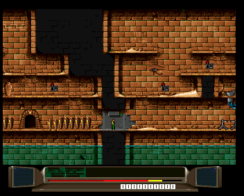
  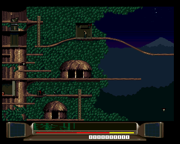
  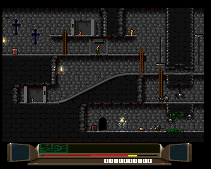
  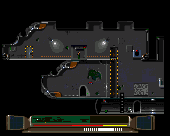
  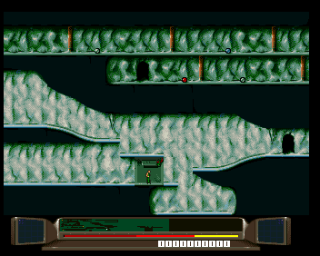
  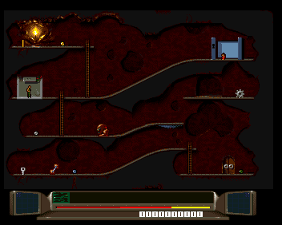
  
</p>

**Widescreen** — the engine simulates the whole level; the native renderer re-derives the world beyond the original 320px window (16:9 above, 21:9 below), with the in-game OPTIONS menu to switch live:

<p align="center">
  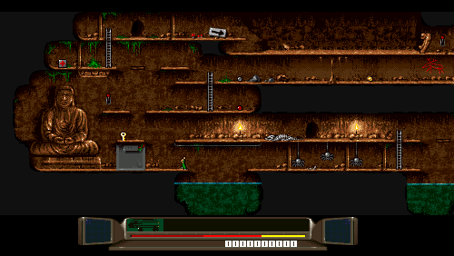
  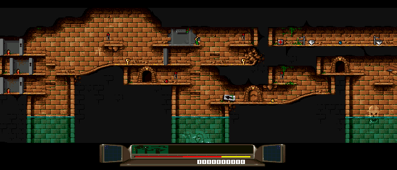
  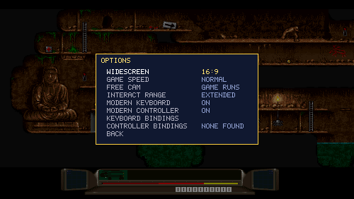
</p>

<p align="center">
  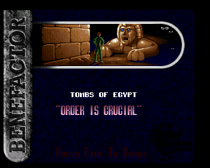
  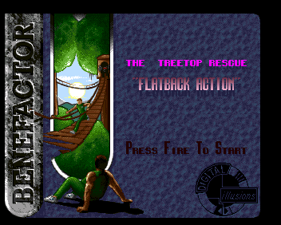
  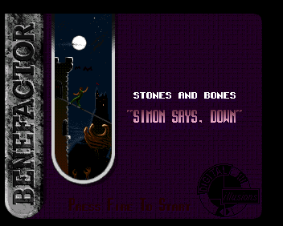
  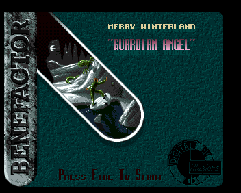
  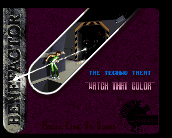
</p>

<p align="center">
  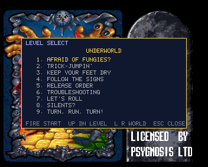
  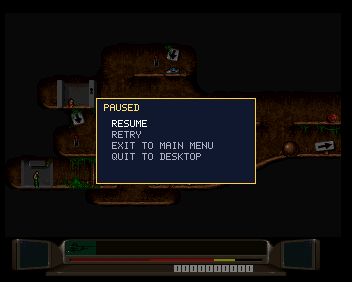
</p>

The repository does **not** include the original game disks, the Kickstart ROM, or the WHDLoad install file — they're copyrighted. You must supply your own copies.

## Required files (you provide)

Hashes are SHA-256.

### To play the game (standalone PC port)

Drop the three disk images at the repo root:

```
Disk.1                                            25416a6e390cbe94e4b2375c9513a2adf3411072fc5b6069ea34a0f3ff697916  (1003520 bytes)
Disk.2                                            f3649c8db4adfce3c7da5e21cb018be098404771eceeec44741c2528e9071b73  (1003520 bytes)
Disk.3                                            8dd262d02174a6706d5214b25f7bd9fc4bffe94761e16c209b880bc1dd8e7a42  (1003520 bytes)
```

### To run the PC↔PUAE comparison harness (development only)

The harness boots PUAE as a reference, so it also needs the Kickstart 3.1 A1200 ROM and the WHDLoad install file in a `harness/` directory:

```
harness/Benefactor.slave                          7ee0edba0e0f3eb8da38fb3aaccead4324e7aa12a6d99ad81a9c15ecf33d4670  (1084 bytes)
harness/kick40068.A1200                           6d43840d4099a74170ea0f0425b6257c3891ebcaa39c4d1840075a9ab22b5707  (524288 bytes)
```

If you're using a Cloanto/AmigaForever encrypted Kickstart instead, also drop the matching `harness/rom.key` next to it — PUAE will pick it up automatically. The unencrypted ROM hashed above needs no key.

Verify any of them with `sha256sum -c` against the lines above.

## Build

```bash
git submodule update --init --recursive
cmake -S . -B build
cmake --build build -j"$(nproc)"
```

## Run

The standalone PC port (native game loop, single SDL window):

```bash
./run_pc_game.sh
```

Side-by-side comparison vs PUAE (used for verifying behavior):

```bash
./run_harness_interactive.sh
```

### Keyboard

| Key | Action |
|-----|--------|
| Arrows | Move (also: navigate menus; ←/→ cycles level in the LEVEL SELECT panel) |
| Z / Ctrl / Space / Return | Fire / Action / Jump / Menu select. With default (vanilla) controls, Fire also picks up items, pulls levers, and drops with Down. |
| X / Left Shift | **Interact** — pick up items *and merry men*, pull levers (*modern controls*; separate from Fire, so you can long-jump while standing on an item) |
| X + Down, or Right Shift | **Drop** the carried item (*modern controls*). Down alone still goes prone — dropping never triggers prone, and Fire+Down no longer drops |
| Esc | In-game **pause menu** (Resume / **Options** / Retry / Exit to main menu / Quit); elsewhere it quits |
| TAB (hold) | **Fast forward** (5×) while held — a ▶▶ icon shows top-left; music keeps normal speed |
| C | **Free cam** toggle (widescreen only) — detach the camera and pan with ←/→ while a camera icon shows; toggle again to snap back |
| S / D | Save / load a savestate (`logs/savestate.bin`) |
| F11 | Toggle fullscreen |
| L | Debug: trigger LEVEL COMPLETE |
| O | Debug: trigger GAME OVER |

### Controller

Hot-pluggable SDL game controllers (connect/disconnect any time). Defaults: dpad / left stick = move, **A** (or B) = fire, **Start** = pause menu, **Back** = free cam, **RightTrigger** (hold) = fast forward; with modern controls on the controller, **X** = interact and **Y** = drop. Everything is rebindable in the in-game OPTIONS → CONTROLLER BINDINGS page (or the `pad_*` JSON keys).

## Configuration

Optional tunables live in a JSON file `benefactor.json` next to the disks (copy
`benefactor.example.json`). Env vars of the same name still override it. Current keys:

| Key | Default | Meaning |
|-----|---------|---------|
| `widescreen_mode` | `"disabled"` | Widescreen preset: `disabled` (original 4:3) \| `16:9` \| `ultrawide` (21:9) \| `auto` (follows the window aspect on every resize). Switchable live in the OPTIONS menu. |
| `game_speed` | `"normal"` | `normal` \| `turbo` (1.2×) \| `hyper` (1.5×). Music and SFX always play at normal speed. The hold-to-fast-forward binding (5×) is separate. |
| `freecam_pause` | `false` | Free cam behaviour: `false` = game keeps running while the camera is detached, `true` = game pauses while panning. |
| `modern_controls_keyboard` / `modern_controls_controller` | `false` | **Opt-in modern control scheme, per device.** `false` = authentic Amiga controls (Fire does pickup/interact/drop-with-Down, Up = jump). `true` enables Interact (incl. picking up merry men), a dedicated Drop, and Fire no longer interacts. Mixed setups work — each device keeps its own scheme. (Legacy `modern_controls` sets the default for both.) |
| `interact_extend` | `0` | Extra **horizontal** (X) reach in pixels for pickup + interaction, on top of each object's vanilla window (vertical reach unchanged). Applies in **both** schemes. The OPTIONS toggle uses 5. |
| `bind_*` / `pad_*` | see `benefactor.example.json` | **Bindings** for keyboard (`bind_left/right/up/down/hop/fire/interact/drop/ffwd/freecam`) and controller (`pad_…`). Each value is a comma-separated list of *chords*; a chord is keys joined by `+` (e.g. `"X+Down, RShift"`). Keyboard names: `Up/Down/Left/Right`, `Space`, `Return`, shifts/ctrls, `Tab`, letters/digits, or any SDL key name. Controller names: `A/B/X/Y`, `DPUp/…`, `Start/Back`, `LB/RB`, `LeftTrigger/RightTrigger`, stick directions `LeftX-/LeftX+/…`. Rebind in-game via OPTIONS → … BINDINGS (press-to-capture). |

All of the OPTIONS-menu settings are written back to `benefactor.json` automatically.

## How it runs

The original binary is a moving target — different overlays load different code at the same chip-RAM addresses depending on game state. The port handles this as a hybrid:

- A **Python recompiler** (`tools/recomp/`) lifts the M68K binary to C, one bank per overlay. `rt.c`'s dispatch picks the right bank at runtime based on which overlay is active.
- A growing set of **hand-written native C** (`src/port/overrides/*.c`, `src/render/native_renderer.c`, etc.) replaces recompiled M68K with code we own.
- A **native renderer** walks the copper list from chip RAM each frame and rasterises directly into an SDL framebuffer — no PUAE emulation at runtime.

### Reverse-engineered (native C, ours)

These subsystems don't run recompiled M68K — they're hand-written C:

| Subsystem | Files | Notes |
|-----------|-------|-------|
| Frame renderer | `recomp/native_renderer.c` | Walks the copper list each frame, composites BPLs + sprites, writes ARGB into the SDL framebuffer. |
| Blitter | `recomp/hw_blitter.c` | Implements asc/desc, line, cookie-cut, fill. Sufficient to render the game. |
| Audio | `recomp/hw_audio.c` | Mixes the 4 Paula channels from the live register shadows into 22050 Hz SDL audio. |
| Boot disk loader + ATN! decrunch | `recomp/disk_boot.c`, `pc_overrides_boot.c` | Reads raw `Disk.N` images, runs the ATN!-decruncher. Replaces the M68K-side raw-MFM disk reader. |
| Overlay loader (`$6D714` / `$150`) | `pc_overrides_boot.c` | All four `D0` paths: gameplay overlay (`d0=0`), boot/title (`d0=1`), reserved (`d0=2`), end-game/credits (`d0=3`). Replays the `$6D734→$150..$2A57` block-copy so low-RAM engine state is correct. |
| Title main menu | `pc_overrides.c` (`native_menu_setup` / `native_main_menu_fire_dispatch`) | Our menu setup + fire-dispatch replace `$003872` / `$0039D0`. PLAY GAME / LEVEL SELECT / LOAD EXTRA LEVELS. |
| Menu glyph blit | `pc_overrides_boot.c` | "ENTER PASSWORD" → "LEVEL SELECT" substitution without touching chip RAM. |
| Per-level disk reader (`$577B8C`) | `pc_overrides_boot.c` `native_gp_disk_read` | Gameplay engine's "stream level data from disk" — natively a `disk_boot_load`. |
| Timer-IRQ delivery | `pc.c` `coro_deliver_timer_irq`, `pc_music_tick` | We call the game's installed LVL3 / LVL6 handlers at the right rate; no CIA-B timer emulation. |
| Pause menu / level-select UI / poster-on-exit | `pc_pause_menu.c`, `pc_level_select_ui.c`, `pc.c` `title_coro_entry` | Wholly new code. |

Many other overrides in `pc_overrides_*.c` are **wrappers** around recompiled M68K — they delegate to the recompiled function and then patch a small detail (a copper write-back, a missed flag toggle, etc.). Those aren't reverse-engineered, just guarded.

### Still recompiled (static M68K → C)

These banks are mechanical translations of the original code. They run unchanged when the matching bank flag is set.

| Bank | File(s) | Functions | What it covers |
|------|---------|-----------|----------------|
| Intro / system | `game_boot.c`, `game_loop.c`, `game_animation.c`, `game_blitter.c`, `game_sprite.c`, `game_render.c`, `game_timer.c`, `game_misc.c`, `game_discovered.c` | ~65 | Cold boot at `$3000`, intro/crawl, top-level state-machine dispatch. |
| Title / gp bank | `game_gp_*.c` | 57 | Title cover-art attract loop, main menu, poster, leaderboard. |
| Gameplay engine | `game_gpl_*.c` | 914 | All in-cavern gameplay — player, enemies, level transitions, level-card. The big chunk that hasn't been re-engineered yet. |
| End-game / credits | `game_credits_*.c` | 14 | Teleport-out cutscene + credits, loaded from Disk.3 on the W6L2 win. |

See `instructions/gameplay-engine-map.md` for the working RE map of the gameplay engine — subsystem labels are best-guesses from first-instruction patterns, refined as native ports replace them.

## Modifications to the original game

These change *how* the game runs, but the player still does the same things — they're not new features.

- **Instant disk load.** The original game's disk reader emulates raw MFM track decoding through Paula DMA — on Amiga hardware that takes real time, on PUAE it's still ~5 s of "ACCESSING!" between screens because the emulator faithfully reproduces the timing. Here `disk_boot_load` reads straight from the `.adf` image and `atn_decrunch` runs in C, so the access screen flashes by in a frame.
- **Instant boot.** Same idea applied to launch — the recompiled cold-start does the disk decrunch synchronously from `.adf`, then drops the coroutine into the engine. No floppy-seek latency, no boot ROM, no Workbench. From shell to title screen is one frame.
- **Synchronous blitter.** `hw_blitter.c` completes each blit fully on `BLTSIZE` write rather than scheduling it across cycles. Effectively zero wait at `btst #6, $DFF002` (`BBUSY`). The game's wait-for-blitter loops still spin once (we report BBUSY=0 immediately), so semantics are unchanged.

## Additions to the game itself

These change what the player can do — features that didn't exist in the 1994 release.

- **In-game pause menu (ESC / pad Start)** — overlay with five options:

  | Option | Effect |
  |--------|--------|
  | **Resume** | Continue play. |
  | **Options** | The OPTIONS submenu (below). |
  | **Retry** | Restart the current level at its title card. |
  | **Exit to main menu** | Drop straight into the cover-art / poster screen. |
  | **Quit to desktop** | `exit(0)`. |

  Navigate with ↑/↓ (←/→ cycles option values), select with Fire / pad A; ESC or pad B backs out a page.

- **Main-menu LEVEL SELECT** — replaces the original "ENTER PASSWORD" row. Fire on it to open a per-world panel, ←/→ cycle through 60 levels, fire again to play. No password typing.

- **OPTIONS menu (in the pause menu)** — live, persisted to `benefactor.json`: widescreen preset, game speed, free-cam mode, interact range, per-device modern controls, and full key/button rebinding pages with press-to-capture.

- **Widescreen (16:9 / ultrawide / auto)** — the native renderer re-derives the level tilemap, objects, characters and merry men beyond the original 320px window, so you genuinely see more of the world (no stretching). `auto` follows the window aspect as you resize. Switchable at runtime.

- **Modern controls, per device** — Interact (items, levers, **merry men**) and Drop move off Fire onto their own buttons, independently for keyboard and controller; the authentic scheme remains the default and the two can be mixed.

- **Game controller support** — hot-pluggable SDL game controllers with full rebinding.

- **Free cam (C / pad Back)** — detach the camera and pan around the level (widescreen only); a camera icon shows top-left. By default the game keeps running; an option pauses it while you look around.

- **Turbo & fast forward** — TURBO / HYPER options run the game at 1.2× / 1.5×; holding the fast-forward key runs it at 5× with a ▶▶ icon. Music and SFX always play at normal speed.

## Executable / dev features

These wrap the binary, not the game logic:

- **Savestate (S/D)** — dumps the full game state (M68K register file, coroutine + 4 MB stack, custom-chip shadows, audio channels, bank-routing flags) plus 8 MB of M68K memory to `logs/savestate.bin`; D reloads. The format is bound to the exact binary that wrote it: ASLR is pinned at startup so the file survives process restarts, and an identity word in the header rejects loads from a different build. `--load <path>` does the same from CLI.
- **Direct level entry** — `--level N` jumps the standalone to level N (1..60) without going through the title flow.
- **Headless mode** — `--headless` runs the standalone with no SDL window (used by automation).
- **Comparison harness** — `run_harness_interactive.sh` boots both PUAE and the PC port side-by-side with a REPL for stepping, dumping framebuffers, watching chip-RAM reads/writes, finding writers/readers of any address.

## TODO

- **Progress-aware LEVEL SELECT.** Track which levels the player has completed; undiscovered levels appear as `??????` and undiscovered worlds can't be navigated to.
- **Save slots with screenshots** *(maybe)*. A proper Save / Load UI on top of the existing savestate format — multiple named slots, each with a framebuffer thumbnail and timestamp. Replaces the all-purpose `logs/savestate.bin` with a real UX.
- **Rewind** *(cheat)*. Ring-buffer of recent savestates with a hold-to-rewind hotkey.

## Layout

| Path | Role |
|------|------|
| `src/port/game_loop.c` | Native game loop |
| `src/engine/` | Recompiler runtime (hw / blitter / copper / native renderer) |
| `src/port/overrides/*.c` | Native C replacements / wrappers for recompiled M68K functions |
| `src/port/pause_menu.c`, `src/port/level_select_ui.c` | Wholly-PC-side UI |
| `src/engine/generated/` | Recompiler output (M68K → C), per bank |
| `tools/recomp/` | Python recompiler (regenerates `generated/`) |
| `vendor/libretro-uae/` | PUAE reference, used by the comparison harness |
| `instructions/gameplay-engine-map.md` | Working RE map of the gameplay engine |

See `CLAUDE.md` and `AGENTS.md` for the development workflow.

## Credits

The original game, *Benefactor* (1994), was developed by **Digital Illusions** and published by **Psygnosis Ltd.** This project is an unofficial reverse-engineering / native port. No original game assets are distributed here — you must supply your own disk images.

Third-party code used by this port and its development harness:

| Project | Used as | License | Upstream |
|---------|---------|---------|----------|
| **libretro-uae / PUAE** | Reference Amiga emulator linked into the comparison harness (development only — the runtime PC port does not use it) | GPLv2 | <https://github.com/libretro/libretro-uae> |
| **SDL2** | Window, input, audio output | zlib | <https://www.libsdl.org/> |
| **Capstone** (Python bindings) | M68K disassembly inside the recompiler (`tools/recomp/`) | BSD-3-Clause | <https://www.capstone-engine.org/> |
| **WHDLoad / `Benefactor.slave`** | Loads the original binary inside PUAE for the comparison harness (development only) | WHDLoad license | <https://www.whdload.de/> |

Thanks to the authors of each of the above — and to the broader Amiga / libretro communities for keeping the platform's tooling alive thirty years on.
