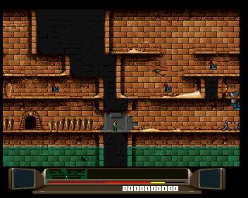
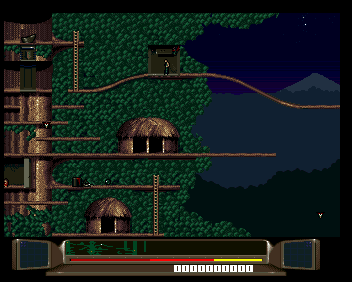
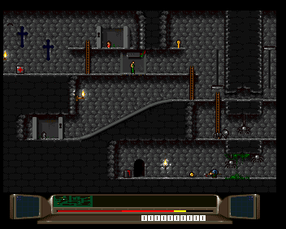
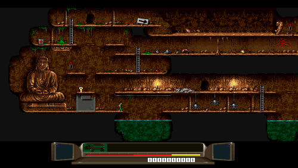
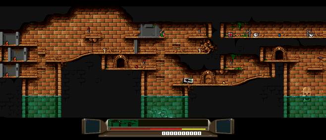

# Benefactor — native PC and Android port

This repository is an in-progress native/dynarec port of *Benefactor* (1994,
Digital Illusions/Psygnosis). The intended product keeps its established native
disk, hardware, renderer, audio, input, UI, and enhancement owners while
executing every remaining 68000 instruction on demand through
`shared/amigaport`.

The current checkout still contains the retired offline 68000-to-C product as
migration input. Do not build or run it as the intended game. Runtime dynarec
integration and representative-gameplay conformance are still missing; see
`docs/project-state.md` and `docs/migration.md`.

No original game disk, Kickstart ROM, WHDLoad file, generated guest code, or
reconstructable game asset belongs in the repository or release packages.

<p align="center">
  
  
  
</p>

<p align="center">
  
  
</p>

These captures document the pre-migration native host and its user-visible
features. They are not evidence that the dynarec product is complete.

## Current feature state

The canonical inventory is `docs/project-state.md`. In summary:

| Capability | State |
| --- | --- |
| Native pause/options and persistent settings | verified |
| Keyboard, controllers, touch, hot-plug, and rebinding | verified |
| 60-level selector, progress, locks, and restored difficulty | verified |
| Classic/optional platformer physics and interaction reach | verified |
| Turbo/Hyper/5x fast-forward with normal-speed audio | verified |
| Faithful/native software/Vulkan renderers and effects | verified |
| True 16:9, 21:9, and live-window widescreen | verified |
| Native disk loading, instant boot, and no floppy waits | verified |
| Free camera, cheats, accessibility, savestate diagnostics | verified/partial |
| Player save-slot UI and rewind | missing |
| `amigaport` 68000 dynarec integration | missing |
| Interpreter/generated-code-free gameplay composition | missing |
| Representative native/dynarec gameplay conformance | missing |

## Player-supplied files

The intended product consumes the original three disk images directly. The
known SHA-256 identities are:

```text
Disk.1  25416a6e390cbe94e4b2375c9513a2adf3411072fc5b6069ea34a0f3ff697916  1003520 bytes
Disk.2  f3649c8db4adfce3c7da5e21cb018be098404771eceeec44741c2528e9071b73  1003520 bytes
Disk.3  8dd262d02174a6706d5214b25f7bd9fc4bffe94761e16c209b880bc1dd8e7a42  1003520 bytes
```

PUAE development comparisons additionally use player-supplied files under
`harness/`:

```text
Benefactor.slave       7ee0edba0e0f3eb8da38fb3aaccead4324e7aa12a6d99ad81a9c15ecf33d4670  1084 bytes
kick40068.A1200        6d43840d4099a74170ea0f0425b6257c3891ebcaa39c4d1840075a9ab22b5707  524288 bytes
```

The intended standalone product does not require Kickstart, WHDLoad, PUAE, or
Ghidra.

## Build and run status

The fresh-clone launcher for the native/dynarec product has not been implemented
yet. Until `docs/migration.md`'s composition gate passes, there is deliberately
no supported gameplay build/run command: the existing CMake and shell paths
select the retired static product and must not be used or documented as current.

The finished interface must be a slim zero-argument `./run.sh` delegating to a
locked Python initializer. It will validate the disks, provision portable build
inputs under `build/`, build the native/dynarec product, and launch it. Tests and
oracle runs remain separate commands.

## Intended runtime

Benefactor loads four executable image generations that reuse guest addresses:
main/intro, title/menu, gameplay, and credits. The product therefore keys
translated blocks and native overrides by image generation plus address. A
native override can make a scoped original call through the dynarec; gameplay
never links or falls back to an interpreter.

The existing native owners remain valuable:

- disk reads, ATN decompression, overlay relocation, and instant loading;
- chip RAM, OCS/CIA service boundaries, blitter, and Paula audio;
- faithful/native/Vulkan rendering and deterministic widescreen;
- logical input, controller/touch policies, pause/options, and level selection;
- native game-flow, interaction, physics, camera, effects, cheats, and
  accessibility behavior; and
- PUAE differential driving, state/frame inspection, and runtime probes.

Architecture and responsibility placement are in `docs/codemap.md`. Recovered
gameplay and audio facts remain in `instructions/gameplay-engine-map.md` and
`instructions/audio-engine.md`.

## Credits

*Benefactor* was developed by Digital Illusions and published by Psygnosis.
This unofficial project distributes only original port/runtime code and
documentation. SDL, Lucent, and libretro-uae/PUAE retain their respective
licenses; PUAE is a development oracle, not part of the gameplay product.
